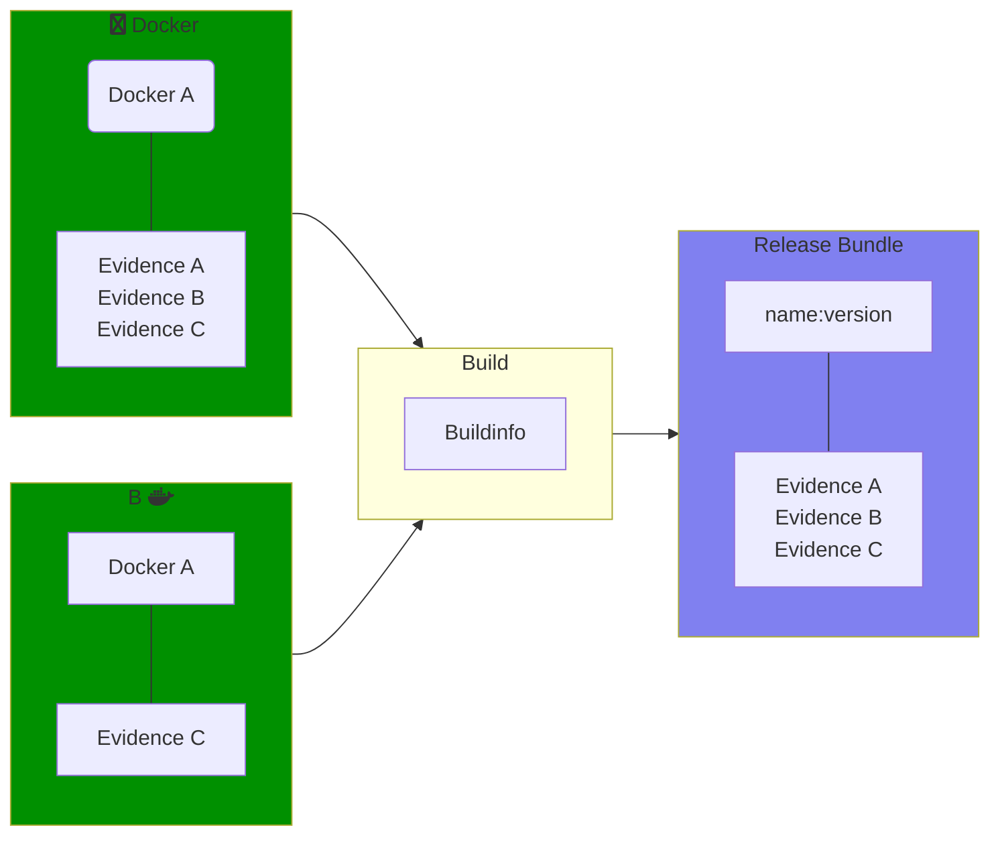

# Evidence intgeration

Demo integration of 🐸 evidence with github action 🚀

```mermaid
graph LR;
    subgraph pA["fa:fa-brands fa:fa-docker Docker"]
        A(Docker A) --- eA[Evidence A\nEvidence B\nEvidence C];

    end
    subgraph pB[B <i class="fab fa-docker"></i>
]
        B[Docker A] --- eB[Evidence C];
    end
    subgraph pBuild[Build]
        Buildinfo
    end
    subgraph pRB[Release Bundle]
        RB[name:version] --- eRB[Evidence A\nEvidence B\nEvidence C];
    end
    pA --> pBuild;
    pB --> pBuild;
    pBuild --> pRB;
    style pA fill:#009000
    style pB fill:#009000
    style pRB fill:#8080F0
```
